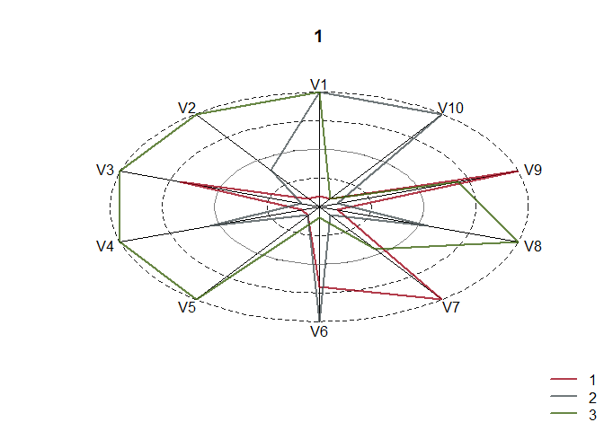
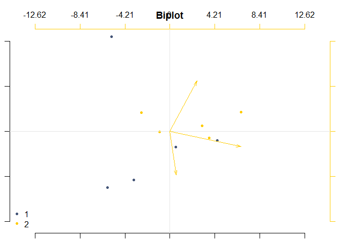
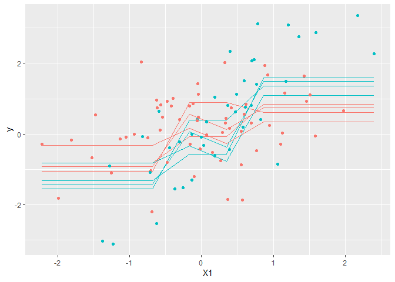

Vignette for R.O.S.P.O library
================
Livio Finos and the others of Rospo
11 febbraio 2019

Utilities from associazionerospo.org
====================================

------------------------------------------------------------------------

Set up
------

To **install** this github package (in R):

    #if devtools is not installed yet: 
    # install.packages("devtools") 
    library(devtools)
    install_github("livioivil/rospo")

Some examples
-------------

### webplot

``` r
library(rospo)

data(pal.unipd.76)


X <- as.data.frame(matrix(rpois(30,3),3,10))
webplot.multi(X,col=pal.unipd.76)
```



``` r
# set colors
data(pal.uno)
palette(pal.uno)
```

### biplot

``` r
par(mar=c(1,1,1,1))
Y=matrix(rnorm(30),10,3)
rownames(Y)=paste("obs",1:nrow(Y))
sv=svd(Y)

pc.biplot(sv)
```


``` r
###########
sv=svd(scale(Y,center=TRUE,scale=FALSE))
pc.biplot(sv,obs.names = TRUE)
```


``` r
pc.biplot(sv,obs.opt = list(col=rep(1:2,5)))
```



### Plot partial effects in a model

``` r
n=100
X=matrix(rnorm(n*3),n,3)
X[,2]=sign(X[,2])
y=rnorm(n,X[,1]+X[,1]*X[,2])
D=data.frame(X)
D$y=y

# Regression model
mod=lm(y~X1*X2+X3,data=D)
summary(mod)
```

    ## 
    ## Call:
    ## lm(formula = y ~ X1 * X2 + X3, data = D)
    ## 
    ## Residuals:
    ##     Min      1Q  Median      3Q     Max 
    ## -2.6937 -0.6751 -0.1059  0.5979  3.1567 
    ## 
    ## Coefficients:
    ##             Estimate Std. Error t value Pr(>|t|)    
    ## (Intercept) -0.12594    0.10704  -1.177    0.242    
    ## X1           1.00323    0.10349   9.694 7.45e-16 ***
    ## X2           0.09518    0.10567   0.901    0.370    
    ## X3           0.06983    0.09209   0.758    0.450    
    ## X1:X2        0.92947    0.10261   9.059 1.70e-14 ***
    ## ---
    ## Signif. codes:  0 '***' 0.001 '**' 0.01 '*' 0.05 '.' 0.1 ' ' 1
    ## 
    ## Residual standard error: 1.051 on 95 degrees of freedom
    ## Multiple R-squared:  0.6481, Adjusted R-squared:  0.6332 
    ## F-statistic: 43.73 on 4 and 95 DF,  p-value: < 2.2e-16

``` r
predict_funct=function(newdata) predict(mod,newdata=newdata)
plot_effects_individual(D,"X1","y",predict_funct=predict_funct,col.by = D$X2)
```


``` r
# Regression tree model
require(rpart)
```

    ## Loading required package: rpart

``` r
mod=rpart(y~X1+X2+X3,data=D,control = list(cp=.0001))
print(mod)
```

    ## n= 100 
    ## 
    ## node), split, n, deviance, yval
    ##       * denotes terminal node
    ## 
    ##  1) root 100 298.24770 -0.05695942  
    ##    2) X1< -0.2617744 37  69.34738 -1.26355300  
    ##      4) X2>=0 18  29.75494 -2.02891800 *
    ##      5) X2< 0 19  19.05917 -0.53846970 *
    ##    3) X1>=-0.2617744 63 143.39700  0.65167470  
    ##      6) X2< 0 34  40.04831 -0.05305522  
    ##       12) X1>=0.4562302 19  18.77715 -0.35551370 *
    ##       13) X1< 0.4562302 15  17.33138  0.33005880 *
    ##      7) X2>=0 29  66.66552  1.47791000  
    ##       14) X1< 0.6602392 15  14.02249  0.43781790 *
    ##       15) X1>=0.6602392 14  19.03024  2.59229400 *

``` r
printcp(mod)
```

    ## 
    ## Regression tree:
    ## rpart(formula = y ~ X1 + X2 + X3, data = D, control = list(cp = 1e-04))
    ## 
    ## Variables actually used in tree construction:
    ## [1] X1 X2
    ## 
    ## Root node error: 298.25/100 = 2.9825
    ## 
    ## n= 100 
    ## 
    ##         CP nsplit rel error  xerror     xstd
    ## 1 0.286686      0   1.00000 1.01747 0.165720
    ## 2 0.122996      1   0.71331 0.81195 0.110165
    ## 3 0.112701      2   0.59032 0.78498 0.103954
    ## 4 0.068846      3   0.47762 0.69040 0.090570
    ## 5 0.013210      4   0.40877 0.57559 0.073826
    ## 6 0.000100      5   0.39556 0.60644 0.075771

``` r
predict_funct=function(newdata) predict(mod,newdata=newdata)
plot_effects_individual(D,"X1","y",predict_funct=predict_funct,col.by = D$X2)
```



``` r
# compare the two:
plot_effects_individual(D,"X3","y",predict_funct=predict_funct,center_effs = TRUE)
```


``` r
plot_effects_individual(D,"X3","y",predict_funct=predict_funct,center_effs = FALSE)
```


