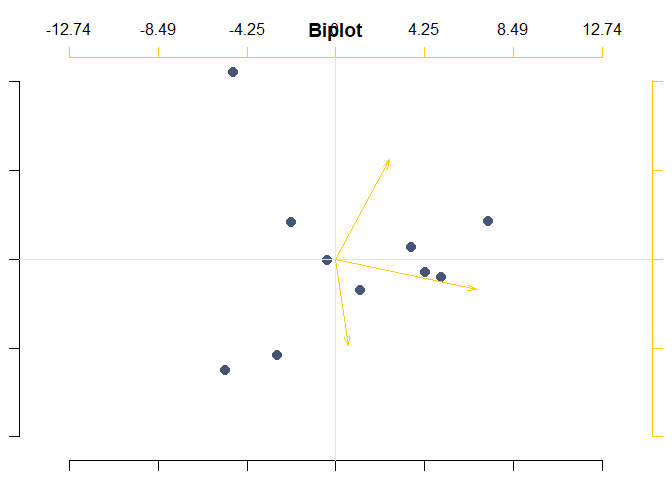
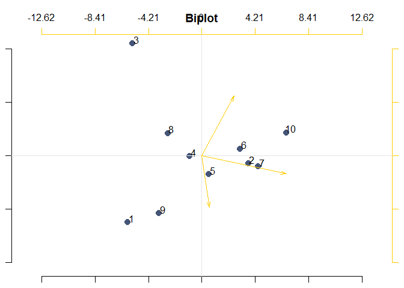

The R.O.S.P.O library
================
Livio Finos and the others of Rospo
11 febbraio 2019

Utilities from associazionerospo.org
====================================

------------------------------------------------------------------------

Set up
------

To **install** this github package (in R):

    #if devtools is not installed yet: 
    # install.packages("devtools") 
    library(devtools)
    install_github("livioivil/rospo")

Some examples
-------------

### webplot

``` r
library(rospo)

data(pal.unipd.76)


X <- as.data.frame(matrix(rpois(30,3),3,10))
webplot.multi(X,col=pal.unipd.76)
```


``` r
# set colors
data(pal.uno)
palette(pal.uno)
```

### biplot

``` r
par(mar=c(1,1,1,1))
Y=matrix(rnorm(30),10,3)
rownames(Y)=paste("obs",1:nrow(Y))
sv=svd(Y)

pc.biplot(sv)
```



``` r
###########
sv=svd(scale(Y,center=TRUE,scale=FALSE))
pc.biplot(sv,obs.names = TRUE)
```



``` r
pc.biplot(sv,obs.opt = list(col=rep(1:2,5)))
```


### Plot partial effects in a model

``` r
set.seed(1)
n=100
X=matrix(rnorm(n*3),n,3)
X[,2]=sign(X[,2])
y=rnorm(n,X[,1]+X[,1]*X[,2])
D=data.frame(X)
D$y=y

# Regression model
mod=lm(y~X1*X2+X3,data=D)
summary(mod)
```

    ## 
    ## Call:
    ## lm(formula = y ~ X1 * X2 + X3, data = D)
    ## 
    ## Residuals:
    ##      Min       1Q   Median       3Q      Max 
    ## -2.35147 -0.54510 -0.06024  0.70062  1.88451 
    ## 
    ## Coefficients:
    ##             Estimate Std. Error t value Pr(>|t|)    
    ## (Intercept)  0.09565    0.10048   0.952    0.344    
    ## X1           0.86927    0.11196   7.764 9.41e-12 ***
    ## X2          -0.05308    0.10039  -0.529    0.598    
    ## X3           0.07689    0.09288   0.828    0.410    
    ## X1:X2        0.64920    0.11254   5.769 9.94e-08 ***
    ## ---
    ## Signif. codes:  0 '***' 0.001 '**' 0.01 '*' 0.05 '.' 0.1 ' ' 1
    ## 
    ## Residual standard error: 0.9507 on 95 degrees of freedom
    ## Multiple R-squared:  0.4509, Adjusted R-squared:  0.4278 
    ## F-statistic:  19.5 on 4 and 95 DF,  p-value: 9.622e-12

``` r
predict_funct=function(newdata) predict(mod,newdata=newdata)
plot_effects_individual(D,"X1","y",predict_funct=predict_funct,col.by = D$X2)
```


``` r
# in this case the same as:
# plot_effects_individual(D,"X1","y",predict_funct=predict_funct,col.by = D$X2,center_effs = FALSE)


# Regression tree model
require(rpart)
```

    ## Loading required package: rpart

``` r
mod=rpart(y~X1+X2+X3,data=D,control = list(cp=.0001))
print(mod)
```

    ## n= 100 
    ## 
    ## node), split, n, deviance, yval
    ##       * denotes terminal node
    ## 
    ##  1) root 100 156.377600  0.28224150  
    ##    2) X1< 0.5939238 71  89.131490 -0.08831340  
    ##      4) X1< -0.6166335 20  32.211400 -0.71278680  
    ##        8) X3< 0.4018905 12  16.658600 -1.11442200 *
    ##        9) X3>=0.4018905 8  10.713480 -0.11033440 *
    ##      5) X1>=-0.6166335 51  46.062190  0.15657810  
    ##       10) X3< -0.7595947 8   8.421524 -0.36719190 *
    ##       11) X3>=-0.7595947 43  35.037670  0.25402370  
    ##         22) X3>=-0.3601846 36  29.166040  0.14004250  
    ##           44) X1>=-0.03056194 19  18.381570 -0.06116896 *
    ##           45) X1< -0.03056194 17   9.155507  0.36492590 *
    ##         23) X3< -0.3601846 7   2.998602  0.84021300 *
    ##    3) X1>=0.5939238 29  33.628580  1.18946200  
    ##      6) X2< 0 14   7.265372  0.54656190 *
    ##      7) X2>=0 15  15.175990  1.78950200 *

``` r
printcp(mod)
```

    ## 
    ## Regression tree:
    ## rpart(formula = y ~ X1 + X2 + X3, data = D, control = list(cp = 1e-04))
    ## 
    ## Variables actually used in tree construction:
    ## [1] X1 X2 X3
    ## 
    ## Root node error: 156.38/100 = 1.5638
    ## 
    ## n= 100 
    ## 
    ##         CP nsplit rel error  xerror    xstd
    ## 1 0.214977      0   1.00000 1.02029 0.15404
    ## 2 0.071540      1   0.78502 0.89723 0.12240
    ## 3 0.069434      2   0.71348 0.94035 0.12114
    ## 4 0.030946      3   0.64405 0.86327 0.12084
    ## 5 0.017509      4   0.61310 0.86565 0.11399
    ## 6 0.010417      6   0.57809 0.86918 0.11371
    ## 7 0.000100      7   0.56767 0.85233 0.11296

``` r
predict_funct=function(newdata) predict(mod,newdata=newdata)
plot_effects_individual(D,"X1","y",predict_funct=predict_funct,col.by = D$X2)
```


``` r
plot_effects_individual(D,"X1","y",predict_funct=predict_funct,col.by = D$X2,center_effs = FALSE)
```


